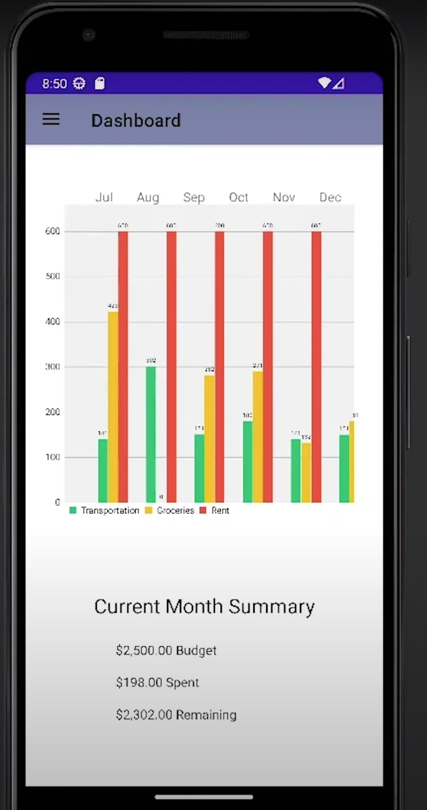
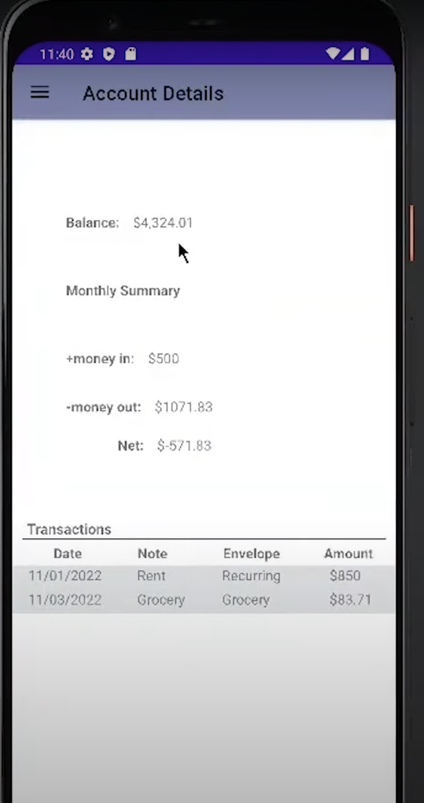
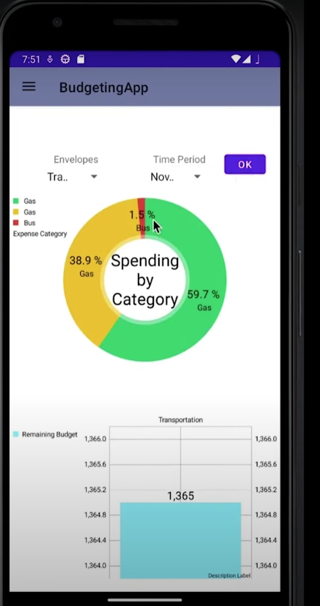

# Budgeting Application Project [Human Computer Interaction]

## Description

This project focused on principles of design and interaction of software. This includes, multidimensional data visualization techniques, interaction techniques, and intelligent user interfaces. The objective was to become more familiar of popular research and industry relevant areas within Human Computer Interaction.

The system developed was a budgeting app, that is based on the "envelope" budgeting system. Users are able to create, edit, and delete envelopes with specific budgets, input and edit transactions, and create and edit accounts. This project allowed me to gain valuable knowledge on the process of user-centered design, and usability testing while going through the development of the application from idea to product. The application was developed with Java in Android Studio.

The main code and activites can be found in [here](BudgetingApp/app/src/main/java/com/example/budgetingapp)

### Some snapshots from the application

